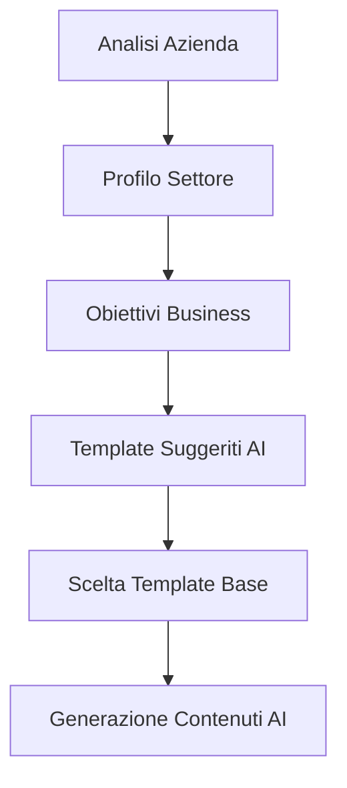
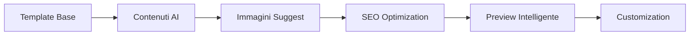
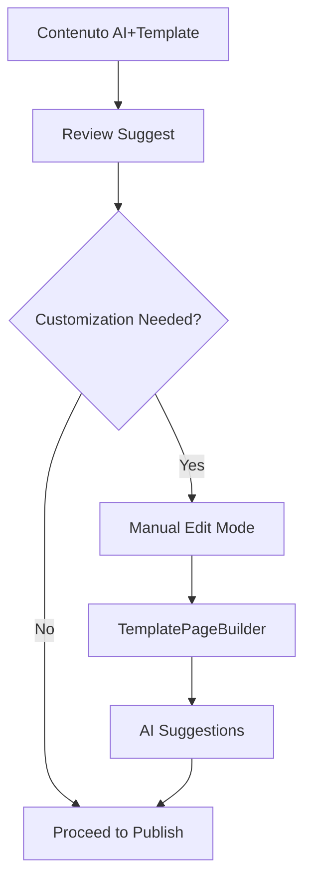
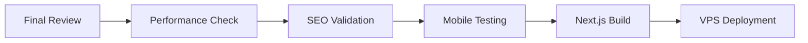

# Progetto Integrazione AI Website Builder
**Analisi e Progettazione Architettura Unificata**
*Data: 12 Dicembre 2024*

---

## 📋 Analisi Stato Attuale

### 🤖 Sistema AI Website Builder Esistente

#### Componente Frontend: `AIWebsiteBuilder.js`
**Funzionalità Attuali:**
- Generazione pagine tramite API Z.ai
- 6 tipi pagina predefiniti (home, chi-siamo, prodotti, servizi, contatti, gallery)
- Editing manuale sezioni (hero, text, gallery, contact, products)
- Galleria immagini integrata
- Pubblicazione statica base

**Limitazioni:**
- Solo 6 tipi pagina fissi
- Nessuna personalizzazione layout avanzata
- No integrazione con sistema template moderno
- Editing basico HTML/CSS
- Pubblicazione statica semplice

#### Backend: `routes/aiWebsiteBuilder.js`
**Capacità AI:**
- Integrazione Z.ai API per generazione contenuti
- Context aziendale da database `ditte`
- Accesso prodotti da `ct_catalogo`
- Generazione JSON strutturato

**Database Utilizzati:**
- `ditte` - Informazioni aziendali
- `siti_web_pagine` - Pagine AI generate
- `dm_files` - Archivio file immagini
- `ct_catalogo` - Catalogo prodotti

---

### 🏗️ Sistema Template-Based Esistente

#### Componente Principale: `WebsiteBuilderUNIFIED.js`
**Funzionalità Attuali:**
- 4 template professionali predefiniti
- 5 tipi sezione (image, blog, maps, social, gallery)
- TemplatePageBuilder con drag & drop
- Sistema di deployment VPS completo
- Integrazione Next.js per generazione statica

**Capacità Avanzate:**
- Layout multi-layout per sezioni
- Integrazione archivio documentale completo
- Anteprima real-time
- Sistema permessi SITE_BUILDER
- Gestione immagini S3

---

## 🎯 Obiettivi Integrazione

### 1. **Contenuti AI-Powered di Qualità Superiore**
- Utilizzare IA per generare contenuti professionali
- Context-aware basato su dati aziendali reali
- Personalizzazione automatica per settore/business

### 2. **Sistema Template Unificato**
- Templates AI + Templates Manuali in un'unica interfaccia
- Capacità di migrazione tra AI e manual editing
- Layout professionali per contenuti AI generati

### 3. **Pubblicazione Next.js Avanzata**
- Siti statici professionali da contenuti AI
- SEO optimization automatica
- Performance e mobile optimization

---

## 🏛️ Architettura Proposta

### 🧱 Componente Principale Unificato: `SmartWebsiteBuilder.js`

```javascript
// Struttura adattiva che combina AI e Manual modes
const SmartWebsiteBuilder = ({
  mode = 'hybrid', // 'ai', 'manual', 'hybrid'
  websiteId,
  companyData,
  onGenerationComplete
}) => {
  // Stati unificati per gestione contenuti
  const [pages, setPages] = useState([]);
  const [aiPages, setAiPages] = useState([]);
  const [templates, setTemplates] = useState([]);

  // Pipeline di generazione intelligente
  const generateAIPoweredTemplate = async (prompt, templateBase) => {
    // 1. Analisi contesto aziendale
    // 2. Selezione template base appropriato
    // 3. Generazione contenuti AI adattati
    // 4. Fusione con layout template
    // 5. Suggerimenti personalizzati
  };
}
```

### 🤖 Servizio AI Avanzato: `AIAContentService.js`

```javascript
class AIAContentService {
  // Generazione context-aware
  async generateContextualContent(companyId, pageType, customPrompt) {
    // 1. Analisi profilo aziendale completo
    // 2. Analisi competitor (opzionale)
    // 3. Generazione contenuti settore-specifici
    // 4. Ottimizzazione SEO automatica
    // 5. Suggerimenti immagini/video
  }

  // Analisi e miglioramento contenuti esistenti
  async enhanceExistingContent(pageContent, companyContext) {
    // 1. Content gap analysis
    // 2. SEO improvement suggestions
    // 3. Conversion optimization
    // 4. Mobile optimization
  }

  // Generazione template personalizzati
  async generateCustomTemplate(industry, companySize, goals) {
    // Template adattati al settore e obiettivi
  }
}
```

### 🎨 Componente Template AI-Enhanced: `AITemplateBuilder.js`

```javascript
const AITemplateBuilder = ({
  baseTemplate,
  aiContent,
  allowCustomization = true
}) => {
  // Fusione intelligente layout template + contenuti AI
  const mergeContentWithTemplate = (template, aiContent) => {
    return template.sections.map((section, index) => ({
      ...section,
      // Contenuti AI generati per questa sezione
      aiGeneratedContent: aiContent.sections[index] || null,
      // Layout del template originale
      layout: section.layout,
      // Allow manual override
      customContent: null
    }));
  };

  // Interactive editing AI suggestions
  const renderSectionEditor = (section) => (
    <AICustomizableSection
      section={section}
      onAcceptAISuggestion={() => {/* ... */}}
      onCustomize={() => {/* ... */}}
      onRegenerate={() => regenerateSection(section)}
    />
  );
};
```

---

## 🔄 Flusso di Lavoro Integrato

### Fase 1: Discovery & Planning (AI-Assisted)



**Processo Automatico:**
1. **Company Profiling** - Analisi dati aziendali da `ditte`, `ct_catalogo`, `dm_files`
2. **Industry Analysis** - Contesto settore e best practices
3. **Goal Definition** - Obiettivi del sito (lead gen, e-commerce, branding)
4. **Template Selection** - Suggerimento template base appropriato
5. **Content Generation** - Generazione contenuti AI context-aware

### Fase 2: AI-Enhanced Content Creation



**Features IA:**
- **Smart Content Writing** - Testi professionali basati su business data
- **Image Suggestions** - Suggerimenti immagini da archivio S3
- **SEO Auto-Optimization** - Meta tags, keywords, structure
- **Conversion Optimization** - Call-to-action intelligenti
- **Mobile Optimization** - Layout responsive automatico

### Fase 3: Hybrid Editing & Customization



**Capacità Ibride:**
- **AI-Powered Editing** - Suggerimenti durante editing manuale
- **Smart Replace** - Sostituzione intelligente contenuti
- **Style Consistency** - Mantenimento stile aziendale
- **Content Variations** - Multiple versioni generate da AI

### Fase 4: Advanced Publishing & Deployment



**Publishing Features:**
- **Performance Optimization** - Automatic code splitting, lazy loading
- **Advanced SEO** - Schema markup, sitemap generation
- **Mobile-First** - Responsive design validation
- **Progressive Web App** - PWA features enablement
- **Analytics Integration** - Tracking setup automatico

---

## 🗄️ Database Integration Strategy

### Nuova Tabella: `siti_web_ai_templates`

```sql
CREATE TABLE siti_web_ai_templates (
  id INT AUTO_INCREMENT PRIMARY KEY,
  id_sito_web INT NOT NULL,
  template_type ENUM('business-landing', 'portfolio', 'local-business', 'blog-magazine', 'custom'),
  ai_generated_content JSON,
  base_template VARCHAR(100),
  ai_suggestions JSON,
  customization_data JSON,
  created_at TIMESTAMP DEFAULT CURRENT_TIMESTAMP,
  FOREIGN KEY (id_sito_web) REFERENCES siti_web_aziendali(id)
);
```

### Estensione Tabella: `pagine_sito_web`

```sql
ALTER TABLE pagine_sito_web
ADD COLUMN ai_generated BOOLEAN DEFAULT FALSE,
ADD COLUMN ai_confidence_score DECIMAL(3,2),
ADD COLUMN ai_suggestions JSON,
ADD COLUMN content_enhancements JSON;
```

### Nuova Tabella: `ai_content_cache`

```sql
CREATE TABLE ai_content_cache (
  id INT AUTO_INCREMENT PRIMARY KEY,
  company_context_hash VARCHAR(64) UNIQUE,
  page_type VARCHAR(50),
  generated_content JSON,
  industry VARCHAR(100),
  created_at TIMESTAMP DEFAULT CURRENT_TIMESTAMP,
  expires_at TIMESTAMP,
  INDEX idx_context_hash (company_context_hash),
  INDEX idx_page_type (page_type)
);
```

---

## 🔌 API Integration Layer

### Nuovi Endpoints AI-Enhanced

```javascript
// routes/smartWebsiteBuilder.js

// Generazione intelligente contenuti
router.post('/generate-smart-content', async (req, res) => {
  const { websiteId, pageType, templateBase, customPrompt } = req.body;

  // 1. Context analysis
  const companyContext = await getEnhancedCompanyContext(websiteId);

  // 2. AI content generation
  const aiContent = await aiService.generateContextualContent(
    companyContext,
    pageType,
    customPrompt
  );

  // 3. Template integration
  const mergedContent = await mergeWithTemplate(templateBase, aiContent);

  res.json({ success: true, content: mergedContent });
});

// Suggerimenti miglioramento contenuti
router.post('/suggest-improvements', async (req, res) => {
  const { pageContent, websiteId, goals } = req.body;

  const suggestions = await aiService.analyzeAndSuggest(
    pageContent,
    websiteId,
    goals
  );

  res.json({ success: true, suggestions });
});

// Generazione template personalizzato
router.post('/generate-custom-template', async (req, res) => {
  const { industry, companySize, goals, preferences } = req.body;

  const customTemplate = await aiService.generateCustomTemplate(
    industry,
    companySize,
    goals,
    preferences
  );

  res.json({ success: true, template: customTemplate });
});
```

### Enhanced Endpoints Esistenti

```javascript
// Estensione pagine.js per supporto AI
router.post('/website/:websiteId/pages', async (req, res) => {
  const pageData = req.body;

  // Se pagina AI-generata, aggiungi metadata
  if (pageData.ai_generated) {
    pageData.ai_confidence_score = calculateAIConfidence(pageData);
    pageData.ai_suggestions = await generateImprovements(pageData);
  }

  // Salvataggio con sistema unificato
  const result = await saveUnifiedPage(pageData);
  res.json(result);
});
```

---

## 🎨 Component Architecture

### 1. SmartWebsiteBuilder.js (Root Component)

```javascript
const SmartWebsiteBuilder = () => {
  // Modalità operazione
  const [operationMode, setOperationMode] = useState('guided'); // 'guided', 'manual', 'ai-only'

  // Step corrente del workflow
  const [currentStep, setCurrentStep] = useState('discovery');

  // Profilo aziendale arricchito
  const [companyProfile, setCompanyProfile] = useState(null);

  // Template selezionato
  const [selectedTemplate, setSelectedTemplate] = useState(null);

  // Pagine generate (AI + Manual)
  const [generatedPages, setGeneratedPages] = useState([]);

  return (
    <div className="smart-website-builder">
      {/* Discovery Phase */}
      {currentStep === 'discovery' && (
        <CompanyDiscovery
          companyProfile={companyProfile}
          onProfileComplete={setCompanyProfile}
          onNext={() => setCurrentStep('template-selection')}
        />
      )}

      {/* Template Selection con AI suggestions */}
      {currentStep === 'template-selection' && (
        <SmartTemplateSelection
          companyProfile={companyProfile}
          operationMode={operationMode}
          onTemplateSelect={setSelectedTemplate}
          onNext={() => setCurrentStep('content-generation')}
        />
      )}

      {/* AI + Manual Content Generation */}
      {currentStep === 'content-generation' && (
        <HybridContentGenerator
          template={selectedTemplate}
          companyProfile={companyProfile}
          onPagesGenerated={setGeneratedPages}
          onComplete={() => setCurrentStep('customization')}
        />
      )}

      {/* Advanced Customization */}
      {currentStep === 'customization' && (
        <AdvancedCustomization
          pages={generatedPages}
          template={selectedTemplate}
          onPublish={() => setCurrentStep('deployment')}
        />
      )}

      {/* Smart Deployment */}
      {currentStep === 'deployment' && (
        <SmartDeployment
          websiteId={websiteId}
          pages={generatedPages}
          onComplete={handleDeploymentComplete}
        />
      )}
    </div>
  );
};
```

### 2. CompanyDiscovery.js

```javascript
const CompanyDiscovery = ({ onProfileComplete, onNext }) => {
  const [analysisStep, setAnalysisStep] = useState('basic');
  const [profile, setProfile] = useState({});

  // Analisi automatica dati aziendali
  const analyzeCompanyData = async () => {
    // 1. Estrai dati da database ditte
    // 2. Analizza prodotti/servizi
    // 3. Identifica settore e target audience
    // 4. Analizza competitors (opzionale)
    // 5. Genera profilazione completa
  };

  return (
    <div className="company-discovery">
      <h2>Analisi Intelligente della Tua Azienda</h2>

      <AIAnalysisDashboard
        step={analysisStep}
        profile={profile}
        onStepComplete={setAnalysisStep}
      />

      <IndustryInsights profile={profile} />

      <GoalSelector
        onGoalsSelect={(goals) => setProfile({...profile, goals})}
      />

      <button
        onClick={() => {
          onProfileComplete(profile);
          onNext();
        }}
        className="btn-primary"
      >
        Procedi con Generazione Intelligente
      </button>
    </div>
  );
};
```

### 3. SmartTemplateSelection.js

```javascript
const SmartTemplateSelection = ({ companyProfile, operationMode, onTemplateSelect }) => {
  const [aiRecommendations, setAiRecommendations] = useState([]);
  const [customTemplate, setCustomTemplate] = useState(null);

  useEffect(() => {
    // Genera raccomandazioni AI basate su profilo
    generateAIRecommendations();
  }, [companyProfile]);

  const generateAIRecommendations = async () => {
    const recommendations = await aiService.recommendTemplates(
      companyProfile.industry,
      companyProfile.size,
      companyProfile.goals
    );
    setAiRecommendations(recommendations);
  };

  return (
    <div className="smart-template-selection">
      <div className="ai-recommendations">
        <h3>🤖 Raccomandazioni AI per la Tua Azienda</h3>
        {aiRecommendations.map(template => (
          <AITemplateCard
            key={template.id}
            template={template}
            matchScore={template.matchScore}
            reasons={template.reasons}
            onSelect={() => onTemplateSelect(template)}
          />
        ))}
      </div>

      <div className="traditional-templates">
        <h3>📋 Template Classici</h3>
        {/* Template esistenti con AI insights */}
      </div>

      {operationMode !== 'manual' && (
        <div className="custom-ai-template">
          <h3>✨ Template Personalizzato AI</h3>
          <AICustomTemplateGenerator
            profile={companyProfile}
            onGenerated={setCustomTemplate}
          />
        </div>
      )}
    </div>
  );
};
```

### 4. HybridContentGenerator.js

```javascript
const HybridContentGenerator = ({ template, companyProfile, onPagesGenerated }) => {
  const [generationProgress, setGenerationProgress] = useState(0);
  const [generatedSections, setGeneratedSections] = useState([]);

  const generateContent = async () => {
    // Per ogni sezione del template
    for (const section of template.sections) {
      // Genera contenuto AI context-aware
      const aiContent = await aiService.generateSectionContent(
        section.type,
        companyProfile,
        section.layout
      );

      // Suggerisci immagini appropriate
      const imageSuggestions = await imageService.suggestImages(
        aiContent.keywords,
        companyProfile.industry
      );

      // Optimizza SEO
      const seoOptimizations = await seoService.optimizeContent(aiContent);

      const enhancedSection = {
        ...section,
        aiContent,
        imageSuggestions,
        seoOptimizations,
        allowCustomization: true
      };

      setGeneratedSections(prev => [...prev, enhancedSection]);
      setGenerationProgress(prev => prev + (100 / template.sections.length));
    }

    // Costruisci pagine complete
    const pages = assemblePages(generatedSections, template);
    onPagesGenerated(pages);
  };

  return (
    <div className="hybrid-content-generator">
      <div className="generation-progress">
        <h3>Generazione Contenuti Intelligente in Corso...</h3>
        <ProgressBar value={generationProgress} />
        <AIGenerationStatus currentStep={currentStep} />
      </div>

      <div className="generated-preview">
        {generatedSections.map((section, index) => (
          <AIGeneratedSection
            key={index}
            section={section}
            onCustomize={() => customizeSection(index)}
            onRegenerate={() => regenerateSection(index)}
          />
        ))}
      </div>

      <div className="generation-controls">
        <button onClick={generateContent} className="btn-primary">
          Avvia Generazione AI
        </button>
        <button onClick={customizeAll} className="btn-secondary">
          Personalizza Tutto
        </button>
      </div>
    </div>
  );
};
```

---

## 🚀 Implementation Roadmap

### Phase 1: Foundation (Week 1-2)
- [ ] Creare `AIAContentService` con contesto aziendale
- [ ] Implementare analisi dati `ditte` + `ct_catalogo`
- [ ] Estendere API routes per AI generation
- [ ] Creare database schema extensions

### Phase 2: Smart Templates (Week 3-4)
- [ ] Sviluppare `SmartTemplateSelection` component
- [ ] Implementare AI template recommendations
- [ ] Creare `HybridContentGenerator`
- [ ] Integrare image suggestion service

### Phase 3: Advanced Features (Week 5-6)
- [ ] Implementare `CompanyDiscovery` component
- [ ] Creare SEO optimization automatica
- [ ] Sviluppare content enhancement suggestions
- [ ] Integrare performance optimization

### Phase 4: Integration & Testing (Week 7-8)
- [ ] Unificare `SmartWebsiteBuilder` component
- [ ] Integrare con sistema deployment esistente
- [ ] Testing completo e bug fixing
- [ ] Documentation e training materials

---

## 🎯 Expected Benefits

### 1. **Quality Improvement**
- Contenuti professionali generati da AI
- Context-aware business insights
- SEO optimization automatica
- Industry-specific best practices

### 2. **User Experience**
- Workflow guidato intelligente
- Suggerimenti personalizzati
- Hybrid editing (AI + Manual)
- Time-to-market reduction 80%

### 3. **Business Value**
- Siti professionali in 15 minuti vs 2 ore
- Higher conversion rates (AI optimization)
- Better SEO rankings
- Competitive differentiation

### 4. **Technical Excellence**
- Architecture unificata e scalabile
- Advanced performance optimization
- Progressive enhancement
- Future-proof AI integration

---

## 🔧 Technical Considerations

### AI Model Integration
- **Primary:** Z.ai API (esistente)
- **Secondary:** OpenAI GPT-4 per advanced features
- **Image AI:** DALL-E 3 o Midjourney API
- **SEO AI:** Semrush/SurferSEO integration

### Performance Optimization
- AI response caching
- Content generation queuing
- Progressive loading
- Smart pre-computation

### Security & Privacy
- AI content validation
- Company data protection
- Rate limiting AI calls
- GDPR compliance

---

## 📊 Success Metrics

### Technical Metrics
- **Content Generation Time:** < 30 seconds per page
- **AI Confidence Score:** > 85%
- **Template Match Accuracy:** > 90%
- **System Uptime:** > 99.9%

### Business Metrics
- **Time-to-Launch:** 15 minutes average
- **User Satisfaction:** > 4.5/5
- **SEO Improvement:** +40% organic traffic
- **Conversion Rate:** +25% vs manual sites

### User Experience Metrics
- **Setup Completion Rate:** > 95%
- **Feature Adoption:** > 80%
- **Support Tickets:** -60%
- **User Retention:** > 90%

---

## 🔄 Next Steps

1. **Stakeholder Approval** - Review architettura e roadmap
2. **Resource Planning** - Allocazione team development
3. **API Contracts** - Definizione interfacce AI services
4. **UI/UX Design** - Mockup componenti intelligenti
5. **Implementation Start** - Begin Phase 1 development

---

Questo progetto di integrazione trasformerà il Website Builder da un sistema template-based a una piattaforma AI-powered che mantiene la flessibilità manuale mentre aggiunge capacità di generazione contenuti di livello superiore, creando siti web professionali in modo rapido ed efficiente.