# Architettura Corretta Sistema Multi-Site Opero

## 🎯 Correzioni Basate su Sistema Opero Esistente

Analizzando il sistema Opero attuale, ho identificato le seguenti correzioni fondamentali:

1. **Storage Catalogo Prodotti**: Già implementato con `dm_files` + `dm_allegati_link`
2. **Autenticazione Multi-Azienda**: Utenti possono operare su multiple ditte
3. **Homepage Operocloud.it**: Diventa sito aziendale, non più pagina di login

---

## 🔧 Correzione 1: Storage Catalogo Prodotti

### Sistema Attuale (Corretto)
Il sistema Opero gestisce già le foto dei prodotti tramite:

```sql
-- Tabelle esistenti già funzionanti
dm_files                    -- Metadati file (immagini, documenti)
dm_allegati_link            -- Collegamenti file ↔ entità
```

### Integrazione con Siti Web
```javascript
// Per le foto prodotti nei siti web, riutilizziamo sistema esistente
const getProductImages = async (productId, companyId) => {
  const [images] = await dbPool.execute(`
    SELECT
      df.id,
      df.file_name_originale,
      df.file_size_bytes,
      df.mime_type,
      df.s3_key
    FROM dm_files df
    JOIN dm_allegati_link dal ON df.id = dal.id_file
    WHERE dal.entita_tipo = 'CATALOGO_PRODOTTI'
    AND dal.entita_id = ?
    AND df.id_ditta = ?
    ORDER BY dal.created_at ASC
  `, [productId, companyId]);

  return images.map(img => ({
    id: img.id,
    url: `${process.env.CDN_BASE_URL}/${img.s3_key}`,
    name: img.file_name_originale,
    size: img.file_size_bytes,
    type: img.mime_type
  }));
};
```

### Storage Structure Corretta
```
Aruba S3 Bucket:
├── uploads/                      # Allegati email (esistente)
├── dm-files/                     # Document management (esistente)
│   ├── {companyId}/
│   │   ├── 6dc47d28-4481-4fde-91c8-43f28a6768cb/
│   │   └── 0f40197e-b591-43fa-b7a9-34f3d2fd453f/
└── company-websites/            # SOLO per contenuti siti web
    ├── {companyId}/
    │   ├── logos/               # Loghi siti web
    │   ├── banners/             # Banner home page
    │   ├── blog-images/         # Immagini articoli blog
    │   └── general/             # Altre immagini siti
```

---

## 🔐 Correzione 2: Sistema Autenticazione

### Modello Attuale (Multi-Azienda)
```javascript
// Utente può appartenere a multiple ditte
const user = {
  id: 123,
  email: "utente@esempio.com",
  ditte_associate: [
    { id: 1, ragione_sociale: "Azienda Alpha" },
    { id: 2, ragione_sociale: "Azienda Beta" },
    { id: 3, ragione_sociale: "Azienda Gamma" }
  ],
  current_ditta: 1  // Ditta selezionata dopo login
};
```

### Nuovo Sistema per Siti Web

#### **1. Autenticazione Siti Web (1:1 con Ditta)**
```javascript
// Ogni sottodominio è legato a UNA SOLA ditta
const websiteAuth = {
  subdomain: "aziendaalpha",
  company_id: 1,
  website_config: {
    title: "Azienda Alpha Srl",
    theme: "professional"
  }
};

// Login per sito web specifico
POST /api/{subdomain}/login
{
  "email": "utente@esempio.com",
  "password": "****"
}

// Response: JWT con scope limitato a questa ditta
{
  "token": "jwt...",
  "user": {
    id: 123,
    email: "utente@esempio.com",
    id_ditta: 1,  // Fissato per questo sottodominio
    permissions: ["website_edit", "catalog_manage"]
  }
}
```

#### **2. Autenticazione Dashboard Opero (Multi-Azienda)**
```javascript
// Login su operocloud.it
POST /api/login
{
  "email": "utente@esempio.com",
  "password": "****"
}

// Response: Tutte le ditte associate
{
  "token": "jwt...",
  "user": {
    id: 123,
    ditte_associate: [
      { id: 1, ragione_sociale: "Azienda Alpha" },
      { id: 2, ragione_sociale: "Azienda Beta" }
    ],
    current_ditta: null  // Utente sceglie dopo login
  }
}

// Selezione ditta
POST /api/auth/select-company
{
  "ditta_id": 1
}
```

### Middleware Autenticazione Differenziato

```javascript
// lib/auth.js
const jwt = require('jsonwebtoken');

// Auth per siti web (1:1 company)
const authenticateWebsite = async (req, res, next) => {
  const { subdomain } = req.params;

  // Get website config
  const [website] = await dbPool.execute(`
    SELECT id_ditta FROM siti_web_aziendali
    WHERE subdomain = ? AND domain_status = 'active'
  `, [subdomain]);

  if (website.length === 0) {
    return res.status(404).json({ error: 'Site not found' });
  }

  const token = req.headers.authorization?.replace('Bearer ', '');
  if (!token) {
    return req.websiteCompany = website[0];
    return next(); // Allow public access
  }

  try {
    const decoded = jwt.verify(token, process.env.JWT_SECRET);

    // Verify user belongs to this company
    if (decoded.id_ditta !== website[0].id_ditta) {
      return res.status(403).json({ error: 'Unauthorized for this company' });
    }

    req.user = decoded;
    req.websiteCompany = website[0];
    next();
  } catch (error) {
    return res.status(401).json({ error: 'Invalid token' });
  }
};

// Auth per dashboard Opero (multi-company)
const authenticateDashboard = async (req, res, next) => {
  const token = req.headers.authorization?.replace('Bearer ', '');

  if (!token) {
    return res.status(401).json({ error: 'Token required' });
  }

  try {
    const decoded = jwt.verify(token, process.env.JWT_SECRET);

    // Load all user companies
    const [companies] = await dbPool.execute(`
      SELECT d.id, d.ragione_sociale, u.livello
      FROM ditte d
      JOIN utenti u ON d.id = u.id_ditta
      WHERE u.id = ?
    `, [decoded.id]);

    req.user = {
      ...decoded,
      companies: companies,
      current_ditta: req.headers['x-company-id'] || companies[0]?.id
    };

    next();
  } catch (error) {
    return res.status(401).json({ error: 'Invalid token' });
  }
};
```

---

## 🏠 Correzione 3: Homepage Operocloud.it

### Situazione Attuale
```
operocloud.it → Pagina di login
```

### Nuova Struttura
```
operocloud.it → Sito aziendale Opero (Corporate Website)
├── Home (presentazione servizi)
├── Chi Siamo
├── Servizi
├── Soluzioni
├── Blog
├── Contatti
└── Client Area (login clienti) → app.operocloud.it
```

### Implementazione Next.js

```javascript
// pages/index.js (Homepage Opero)
import Head from 'next/head';
import { GetStaticProps } from 'next';
import HeroSection from '../components/website/HeroSection';
import ServicesSection from '../components/website/ServicesSection';
import TestimonialsSection from '../components/website/TestimonialsSection';

export default function OperoHomepage() {
  return (
    <>
      <Head>
        <title>Opero - Gestionale Aziendale All-in-One</title>
        <meta name="description" content="Software gestionale completo per PMI" />
      </Head>

      <div className="min-h-screen">
        <Navigation />
        <HeroSection />
        <ServicesSection />
        <FeaturesSection />
        <TestimonialsSection />
        <PricingSection />
        <ContactSection />
        <Footer />
      </div>
    </>
  );
}

// Client Area redirect
export async function getServerSideProps(context) {
  if (context.pathname === '/client-area') {
    return {
      redirect: {
        destination: 'https://app.operocloud.it',
        permanent: false
      }
    };
  }

  return { props: {} };
}
```

---

## 🏗️ Architettura Corretta

### Struttura Applicazioni

```
┌─────────────────────────────────────────────────────────────────┐
│                    OPERO MULTI-SITE ARCHITECTURE               │
├─────────────────────────────────────────────────────────────────┤
│                                                                 │
│  ┌─────────────────────────────────────────────────────────┐    │
│  │  operocloud.it (Next.js - Corporate Site)              │    │
│  │  • Port: 3000                                           │    │
│  │  • Public website (no login required)                 │    │
│  │  • Company presentation                               │    │
│  │  └── /client-area → app.operocloud.it                │    │
│  └─────────────────────────────────────────────────────────┘    │
│                                                                 │
│  ┌─────────────────────────────────────────────────────────┐    │
│  │  app.operocloud.it (React - Dashboard)                 │    │
│  │  • Port: 3001                                           │    │
│  │  • Multi-company authentication                       │    │
│  │  • Opero core functionality                           │    │
│  │  └── Website Builder module                            │    │
│  └─────────────────────────────────────────────────────────┘    │
│                                                                 │
│  ┌─────────────────────────────────────────────────────────┐    │
│  │  *.operocloud.it (Next.js - Client Sites)              │    │
│  │  • Dynamic routing by subdomain                        │    │
│  │  • Single-company authentication                       │    │
│  │  • Website templates + e-commerce                      │    │
│  │  └── Data sync with Opero database                    │    │
│  └─────────────────────────────────────────────────────────┘    │
│                                                                 │
│  ┌─────────────────────────────────────────────────────────┐    │
│  │  API Backend (Node.js - Shared)                        │    │
│  │  • Port: 3002                                           │    │
│  │  • Multi-tenant routes                                │    │
│  │  ├── /api/* (Opero dashboard)                         │    │
│  │  ├── /api/{subdomain}/* (Client sites)                │    │
│  │  └── /api/website/* (Website builder)                 │    │
│  └─────────────────────────────────────────────────────────┘    │
└─────────────────────────────────────────────────────────────────┘
```

### Database Schema Esteso (Corretto)

```sql
-- Nuova tabella siti web (legata 1:1 con ditte)
CREATE TABLE siti_web_aziendali (
  id INT PRIMARY KEY AUTO_INCREMENT,
  id_ditta INT NOT NULL UNIQUE,  -- 1 sito per ditta
  subdomain VARCHAR(100) UNIQUE NOT NULL,
  domain_status ENUM('active', 'inactive', 'pending') DEFAULT 'pending',

  -- Template configuration
  template_id INT DEFAULT 1,
  theme_config JSON,

  -- SEO e contenuti
  site_title VARCHAR(255),
  site_description TEXT,
  logo_url VARCHAR(500),
  favicon_url VARCHAR(500),

  -- Social e analytics
  google_analytics_id VARCHAR(50),
  facebook_url VARCHAR(500),
  instagram_url VARCHAR(500),
  linkedin_url VARCHAR(500),

  -- Flag per vetrina prodotti
  enable_catalog BOOLEAN DEFAULT FALSE,
  catalog_settings JSON,

  created_at TIMESTAMP DEFAULT CURRENT_TIMESTAMP,
  updated_at TIMESTAMP DEFAULT CURRENT_TIMESTAMP ON UPDATE CURRENT_TIMESTAMP,

  FOREIGN KEY (id_ditta) REFERENCES ditte(id),
  INDEX idx_subdomain (subdomain)
);

-- Pagine per siti web
CREATE TABLE pagine_sito_web (
  id INT PRIMARY KEY AUTO_INCREMENT,
  id_sito_web INT NOT NULL,
  slug VARCHAR(200) NOT NULL,
  titolo VARCHAR(255) NOT NULL,
  contenuto_html LONGTEXT,
  contenuto_json JSON,  -- Page builder data
  meta_title VARCHAR(255),
  meta_description TEXT,
  is_published BOOLEAN DEFAULT FALSE,
  menu_order INT DEFAULT 0,
  created_at TIMESTAMP DEFAULT CURRENT_TIMESTAMP,
  FOREIGN KEY (id_sito_web REFERENCES siti_web_aziendali(id),
  UNIQUE KEY unique_site_slug (id_sito_web, slug)
);

-- Articoli blog
CREATE TABLE articoli_blog (
  id INT PRIMARY KEY AUTO_INCREMENT,
  id_sito_web INT NOT NULL,
  titolo VARCHAR(255) NOT NULL,
  slug VARCHAR(255) NOT NULL,
  contenuto LONGTEXT,
  immagine_url VARCHAR(500),
  categoria VARCHAR(100),
  tags VARCHAR(500),
  meta_title VARCHAR(255),
  meta_description TEXT,
  is_published BOOLEAN DEFAULT FALSE,
  published_at TIMESTAMP NULL,
  created_at TIMESTAMP DEFAULT CURRENT_TIMESTAMP,
  FOREIGN KEY (id_sito_web) REFERENCES siti_web_aziendali(id),
  UNIQUE KEY unique_site_slug (id_sito_web, slug)
);

-- Per i prodotti, ESTENDIAMO il sistema esistente
-- Non creiamo nuove tabelle, ma aggiungiamo config per siti web
ALTER TABLE siti_web_aziendali ADD COLUMN catalog_settings JSON DEFAULT '{}';

-- Settings esempio per catalogo
-- catalog_settings = {
--   "show_prices": false,
--   "enable_cart": false,
--   "catalog_layout": "grid",
--   "products_per_page": 12
-- }
```

---

## 🔄 Flow di Autenticazione Corretto

### 1. Utente arriva su nomeditta.operocloud.it


### 2. Utente arriva su app.operocloud.it

```mermaid
sequenceDiagram
    participant U as Utente
    participant D as Dashboard (app.operocloud.it)
    participant A as API (api.operocloud.it)
    participant DB as Database

    U->>D: Visita dashboard
    D->>U: Mostra pagina login
    U->>D: Inserisce credenziali
    D->>A: POST /api/login {email, password}
    A->>DB: Verifica utente + carica tutte le ditte associate
    A-->>D: JWT + lista ditte
    D->>U: "Seleziona azienda con cui operare"
    U->>D: Seleziona "Azienda Alpha"
    D->>D: Imposta current_ditta = 1
    D->>A: Request con header X-Company-ID: 1
    A->>DB: Carica dati solo per ditta selezionata
    A-->>D: Dati specifici azienda
    D-->>U: Dashboard con dati Azienda Alpha

    Note over U,D: Utente può cambiare azienda anytime
    U->>D: "Cambia azienda" → seleziona "Azienda Beta"
    D->>D: current_ditta = 2
    D->>U: Dashboard con dati Azienda Beta
```



---

## 🚀 Implementazione Tecnica

### 1. Nginx Configuration
```nginx
# /etc/nginx/sites-available/opero-multi-site
server {
    listen 80;
    server_name operocloud.it www.operocloud.it;

    # Sito aziendale Opero
    location / {
        proxy_pass http://localhost:3000;  # Next.js corporate site
        proxy_set_header Host $host;
        proxy_set_header X-Real-IP $remote_addr;
    }

    # Redirect area client a dashboard
    location = /client-area {
        return 302 https://app.operocloud.it;
    }
}

server {
    listen 80;
    server_name app.operocloud.it;

    # Dashboard Opero
    location / {
        proxy_pass http://localhost:3001;  # React dashboard
        proxy_set_header Host $host;
        proxy_set_header X-Real-IP $remote_addr;
    }
}

server {
    listen 80;
    server_name ~^(?<subdomain>.+)\.operocloud\.it$;

    # Siti web clienti
    location / {
        proxy_pass http://localhost:3000;  # Next.js multi-site
        proxy_set_header Host $host;
        proxy_set_header X-Subdomain $subdomain;
        proxy_set_header X-Real-IP $remote_addr;
    }
}
```

### 2. Next.js Multi-Site Structure
```
websites/
├── pages/
│   ├── index.js                    # Routing homepage
│   ├── [slug].js                  # Pagine statiche
│   ├── api/
│   │   └── [subdomain]/
│   │       ├── auth/
│   │       │   └── login.js       # Login specifico sito
│   │       ├── config.js          # Configurazione sito
│   │       ├── pages.js           # Pagine sito
│   │       └── products.js        # Catalogo prodotti (usa dm_files)
│   └── _app.js                    # App layout con auth context
├── components/
│   ├── website/
│   │   ├── Header.js
│   │   ├── Footer.js
│   │   └── ProductGrid.js
│   └── auth/
│       └── WebsiteLoginForm.js
└── lib/
    ├── auth.js                    # Auth utilities
    └── database.js                # Database connection
```

### 3. API Backend Integration
```javascript
// routes/website.js
router.post('/:subdomain/login', async (req, res) => {
  const { subdomain } = req.params;
  const { email, password } = req.body;

  try {
    // Get company from subdomain
    const [website] = await dbPool.execute(`
      SELECT id_ditta FROM siti_web_aziendali
      WHERE subdomain = ? AND domain_status = 'active'
    `, [subdomain]);

    if (website.length === 0) {
      return res.status(404).json({ error: 'Site not found' });
    }

    // Authenticate user
    const [users] = await dbPool.execute(`
      SELECT u.*, d.ragione_sociale
      FROM utenti u
      JOIN ditte d ON u.id_ditta = d.id
      WHERE u.email = ? AND u.id_ditta = ?
    `, [email, website[0].id_ditta]);

    if (users.length === 0) {
      return res.status(401).json({ error: 'Invalid credentials' });
    }

    const user = users[0];

    // Check password (usando sistema esistente)
    const isValidPassword = await bcrypt.compare(password, user.password);
    if (!isValidPassword) {
      return res.status(401).json({ error: 'Invalid credentials' });
    }

    // Generate JWT with single-company scope
    const token = jwt.sign({
      id: user.id,
      email: user.email,
      id_ditta: website[0].id_ditta,
      scope: 'website'
    }, process.env.JWT_SECRET, { expiresIn: '24h' });

    res.json({
      success: true,
      token,
      user: {
        id: user.id,
        email: user.email,
        nome: user.nome,
        cognome: user.cognome,
        company: {
          id: website[0].id_ditta,
          ragione_sociale: user.ragione_sociale
        }
      }
    });

  } catch (error) {
    res.status(500).json({ error: error.message });
  }
});
```

---

## ✅ Vantaggi del Sistema Corretto

### **1. Allineamento con Sistema Opero Esistente**
- Storage prodotti riutilizza `dm_files` + `dm_allegati_link`
- Autenticazione mantiene concetto multi-azienda
- Nessuna duplicazione dati o sistemi

### **2. Separazione Responsabilità Chiara**
- **operocloud.it**: Marketing e presentazione aziendale
- **app.operocloud.it**: Gestione operativa (multi-azienda)
- **nomeditta.operocloud.it**: Vetrina clienti (single-azienda)

### **3. User Experience Migliorata**
- Clienti hanno sito web dedicato e professionale
- Utenti Opero mantengono dashboard multi-azienda
- Login contestuale al dominio visitato

### **4. Scalabilità Ottimale**
- Ogni cliente ha sito indipendente ma condiviso
- Architettura unificata ma flessibile
- Costi infrastruttura minimi

Questo approccio rispetta completamente l'architettura Opero esistente, sfruttando tutti gli asset attuali e aggiungendo valore senza compromettere le funzionalità core.