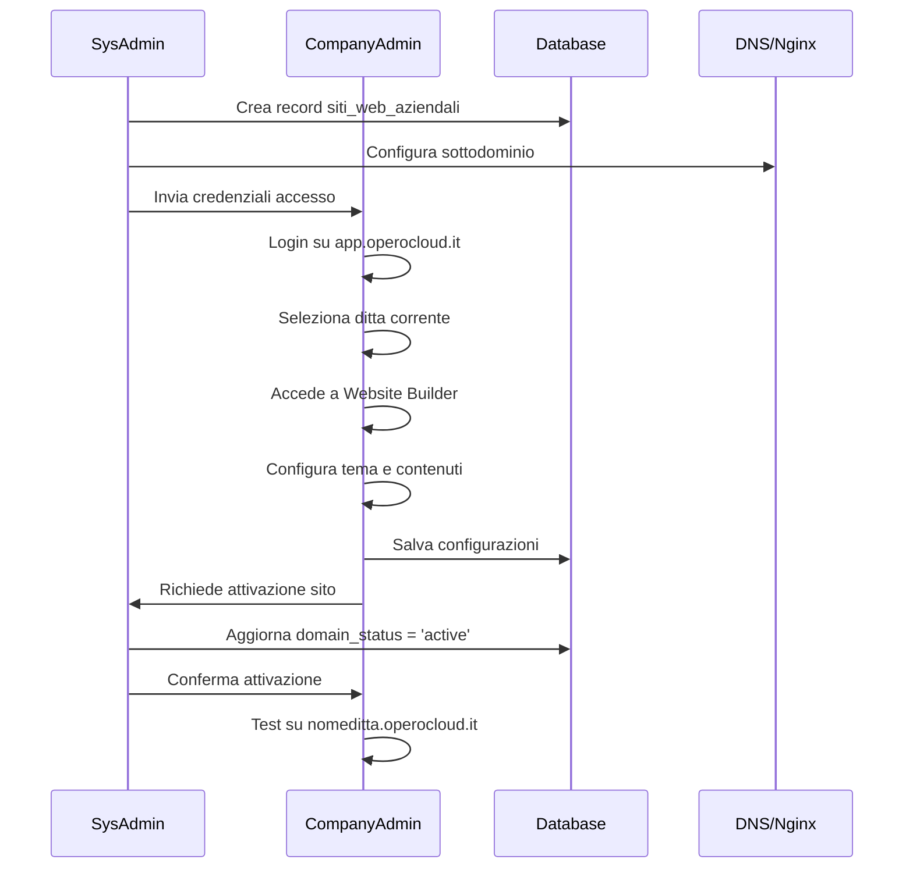
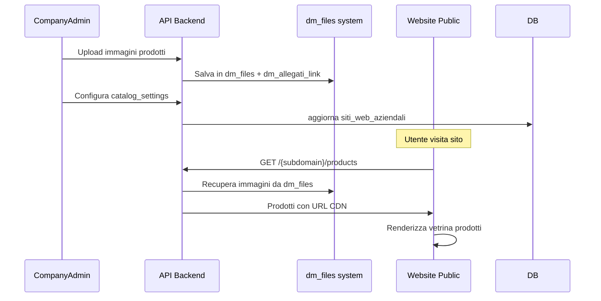

# Guida all'Uso - Sistema Multi-Site Opero

## 📋 Indice
1. [Panoramica del Sistema](#panoramica)
2. [Componenti e Architettura](#componenti)
3. [Ruoli e Permessi](#ruoli)
4. [Guida per Amministratore di Sistema](#admin-sistema)
5. [Guida per Amministratore Ditta](#admin-ditta)
6. [Flussi di Utilizzo](#flussi)
7. [Best Practices](#best-practices)

---

## 🎯 Panoramica del Sistema <a name="panoramica"></a>

Il sistema Multi-Site Opero è progettato per offrire:
- **Siti Web Aziendali**: Ogni ditta può avere il proprio sito web professionale
- **Gestione Centralizzata**: Dashboard unificata per gestire tutte le ditte
- **Integrazione Catalogo**: Riutilizzo del sistema esistente di gestione prodotti

### Struttura dei Domini
```
operocloud.it          → Sito corporate Opero (informazioni aziendali)
app.operocloud.it      → Dashboard gestione (multi-azienda)
nomeditta.operocloud.it → Sito web specifico ditta (vetrina prodotti)
```

---

## 🏗️ Componenti e Architettura <a name="componenti"></a>

### 1. Storage e Gestione File
#### Sistema Esistente (Riutilizzato)
```sql
dm_files              → Metadati dei file (immagini, documenti)
dm_allegati_link      → Collegamenti file ↔ entità
```

#### Nuovo Storage per Siti Web
```
Aruba S3 Bucket:
├── dm-files/                    # Catalogo prodotti (esistente)
│   └── {companyId}/[UUID]/
└── company-websites/            # Contenuti siti web (nuovo)
    ├── {companyId}/
    │   ├── logos/              # Loghi siti
    │   ├── banners/            # Banner homepage
    │   └── blog-images/        # Immagini articoli
```

### 2. Database Schema
```sql
-- Configurazione siti web (1:1 con ditte)
siti_web_aziendali
├── id_ditta (UNIQUE)           → Collegamento con ditta
├── subdomain (UNIQUE)          → Sottodominio sito
├── template_id                 → Template visualizzazione
├── theme_config (JSON)         → Configurazione tema
├── catalog_settings (JSON)     → Impostazioni vetrina
└── enable_catalog (BOOLEAN)    → Attiva/disattiva catalogo

-- Pagine e contenuti
pagine_sito_web                 → Pagine statiche sito
articoli_blog                   → Articoli blog aziendali
```

### 3. Sistema Autenticazione
```javascript
// Dashboard Opero (multi-azienda)
POST /api/login → JWT con tutte le ditte associate
Header: X-Company-ID → Seleziona ditta corrente

// Siti Web (single-azienda)
POST /api/{subdomain}/login → JWT con singola ditta
Scope: Limitato a quel sottodominio
```

---

## 👥 Ruoli e Permessi <a name="ruoli"></a>

### Amministratore di Sistema (SysAdmin)
- **Accesso**: `app.operocloud.it`
- **Scope**: Tutte le ditte nel sistema
- **Competenze**: Gestione infrastruttura globale

### Amministratore Ditta (CompanyAdmin)
- **Accesso**: `nomeditta.operocloud.it` + `app.operocloud.it`
- **Scope**: Solo la propria ditta
- **Competenze**: Gestione sito web e contenuti aziendali

---

## 🔧 Guida per Amministratore di Sistema <a name="admin-sistema"></a>

### 1. Setup Iniziale Siti Web

#### Creazione Sito per Nuova Ditta
```sql
-- 1. Verifica esistenza ditta
SELECT id, ragione_sociale FROM ditte WHERE id = ?;

-- 2. Crea configurazione sito base
INSERT INTO siti_web_aziendali (
  id_ditta,
  subdomain,
  template_id,
  theme_config,
  catalog_settings,
  domain_status
) VALUES (
  ?,                    -- ID ditta
  'nomeditta',          -- Sottodominio univoco
  1,                    -- Template default
  '{"primary_color": "#0066cc", "font_family": "Arial"}',
  '{"show_prices": false, "enable_cart": false}',
  'pending'
);
```

#### Configurazione Nginx
```bash
# Aggiungi virtual host per nuovo sottodominio
server {
    listen 80;
    server_name nomeditta.operocloud.it;

    location / {
        proxy_pass http://localhost:3000;
        proxy_set_header Host $host;
        proxy_set_header X-Subdomain nomeditta;
    }
}
```

### 2. Gestione Template

#### Installazione Nuovo Template
```javascript
// templates/professional/config.json
{
  "name": "Professional",
  "version": "1.0.0",
  "preview": "/templates/professional/preview.jpg",
  "sections": {
    "header": "components/website/Header.js",
    "hero": "components/website/HeroSection.js",
    "services": "components/website/ServicesSection.js",
    "footer": "components/website/Footer.js"
  },
  "customizable": {
    "colors": ["primary", "secondary", "accent"],
    "fonts": ["heading", "body"],
    "layout": ["header_style", "footer_style"]
  }
}
```

### 3. Monitoraggio e Manutenzione

#### Dashboard Sistema
```javascript
// Endpoint per stats globali
GET /api/admin/stats
{
  "total_sites": 45,
  "active_sites": 42,
  "pending_sites": 3,
  "storage_used": "125GB",
  "monthly_bandwidth": "2.3TB"
}
```

#### Backup Automatici
```bash
# Script backup giornaliero
#!/bin/bash
mysqldump --single-transaction opero_db > backup_$(date +%Y%m%d).sql
aws s3 sync s3://company-websites/ s3://backup-websites/$(date +%Y%m%d)/
```

---

## 🏢 Guida per Amministratore Ditta <a name="admin-ditta"></a>

### 1. Configurazione Sito Web

#### Accesso e Setup Iniziale
1. **Login Dashboard**: Accedi a `app.operocloud.it`
2. **Seleziona Ditta**: Scegli la tua azienda dal selettore
3. **Attiva Sito**: Vai a "Website Builder" → "Attiva Sito Web"

#### Personalizzazione Tema
```javascript
// Dashboard → Website Builder → Aspetto
{
  "brand_colors": {
    "primary": "#0066cc",
    "secondary": "#666666"
  },
  "typography": {
    "heading_font": "Montserrat",
    "body_font": "Open Sans"
  },
  "layout": {
    "header_style": "centered",
    "footer_columns": 4
  }
}
```

### 2. Gestione Catalogo Prodotti

#### Abilitazione Vetrina
```javascript
// Dashboard → Website Builder → Catalogo
{
  "enable_catalog": true,
  "catalog_settings": {
    "show_prices": false,        // Nasconde prezzi pubblici
    "enable_cart": false,        // Disabilita e-commerce
    "catalog_layout": "grid",    // Griglia 3 colonne
    "products_per_page": 12,
    "show_description": true,
    "show_categories": true
  }
}
```

#### Caricamento Immagini Prodotti
```javascript
// Utilizza sistema esistente dm_files
// Le foto vengono automaticamente sincronizzate sul sito

// Backend API
GET /api/{subdomain}/products
Response:
{
  "products": [
    {
      "id": 123,
      "nome": "Prodotto A",
      "descrizione": "Descrizione completa...",
      "codice": "ART-001",
      "prezzo_listino": 125.50,
      "images": [
        {
          "url": "https://cdn.operocloud.it/dm-files/1/uuid/photo1.jpg",
          "name": "prodotto-a-1.jpg",
          "is_primary": true
        }
      ],
      "categoria": "Elettronica",
      "disponibile": true
    }
  ]
}
```

### 3. Gestione Contenuti

#### Creazione Pagine
```javascript
// Dashboard → Website Builder → Pagine
{
  "pages": [
    {
      "slug": "chi-siamo",
      "titolo": "Chi Siamo",
      "contenuto": {
        "sections": [
          {
            "type": "hero",
            "title": "La Nostra Storia",
            "subtitle": "Dal 1985 al servizio dei clienti"
          },
          {
            "type": "text",
            "content": "Siamo un'azienda familiare..."
          }
        ]
      },
      "meta_title": "Chi Siamo - Nome Ditta",
      "meta_description": "Scopri la storia della nostra azienda"
    }
  ]
}
```

#### Articoli Blog
```javascript
// Dashboard → Website Builder → Blog
{
  "articles": [
    {
      "title": "Le Novità del 2024",
      "slug": "novita-2024",
      "content": "...",
      "category": "Azienda",
      "tags": ["novità", "2024", "aggiornamenti"],
      "featured_image": "https://cdn.operocloud.it/company-websites/1/blog/featured.jpg"
    }
  ]
}
```

### 4. SEO e Analytics

#### Configurazione SEO
```javascript
// Dashboard → Website Builder → SEO
{
  "site_title": "Nome Ditta - Settore Merceologico",
  "site_description": "Descrizione attività e servizi offerti",
  "meta_keywords": ["parola1", "parola2", "settore"],
  "social_media": {
    "facebook_url": "https://facebook.com/nomeditta",
    "instagram_url": "https://instagram.com/nomeditta",
    "linkedin_url": "https://linkedin.com/company/nomeditta"
  },
  "google_analytics_id": "GA-XXXXXXXXX"
}
```

---

## 🔄 Flussi di Utilizzo <a name="flussi"></a>

### 1. Flusso Attivazione Sito (SysAdmin → Ditta)



### 2. Flusso Gestione Catalogo Prodotti



---

## ✅ Best Practices <a name="best-practices"></a>

### Per Amministratori di Sistema
1. **Monitoraggio Storage**
   - Controlla quotidianamente l'utilizzo S3
   - Imposta alert quando supera l'80% della quota

2. **Sicurezza**
   - HTTPS obbligatorio per tutti i siti
   - Rate limiting su API endpoints
   - Backup giornalieri database + media

3. **Performance**
   - CDN per contenuti statici
   - Cache headers ottimizzati
   - Database indices su query frequenti

### Per Amministratori Ditta
1. **Contenuti**
   - Testo SEO-friendly (min 300 parole per pagina)
   - Immagini ottimizzate per web (max 800px larghezza)
   - Update contenuti almeno mensilmente

2. **Catalogo**
   - Foto prodotti professionali
   - Descrizioni complete e dettagliate
   - Categorizzazione coerente

3. **Analytics**
   - Monitoraggio traffico mensile
   - A/B testing su layout importanti
   - Feedback dei visitatori

---

## 📞 Supporto e Troubleshooting

### Problemi Comuni

#### Sito Non Visibile
```bash
# Controlla configurazione Nginx
nginx -t
systemctl reload nginx

# Verifica DNS
nslookup nomeditta.operocloud.it
```

#### Immagini Non Caricate
```javascript
// Verifica configurazione S3
const checkS3Config = {
  bucket: process.env.S3_BUCKET,
  region: process.env.S3_REGION,
  accessKey: process.env.S3_ACCESS_KEY,
  secretKey: process.env.S3_SECRET_KEY
};
```

#### Login Fallito
```sql
-- Verifica utente e associazione ditta
SELECT u.*, d.ragione_sociale
FROM utenti u
JOIN ditte d ON u.id_ditta = d.id
WHERE u.email = 'admin@nomeditta.it';
```

### Contatti Supporto
- **Email**: support@operocloud.it
- **Documentation**: docs.operocloud.it/multi-site
- **Status Page**: status.operocloud.it

---

## 🔄 Aggiornamenti e Novità

Il sistema viene aggiornato regolarmente con:
- Nuovi template design
- Miglioramenti performance
- Nuove funzionalità e-commerce
- Integrazioni API di terze parti

Mantieni sempre aggiornata la versione per garantire sicurezza e accessibilità alle ultime features.