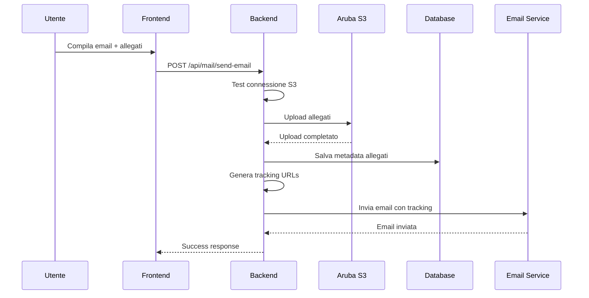
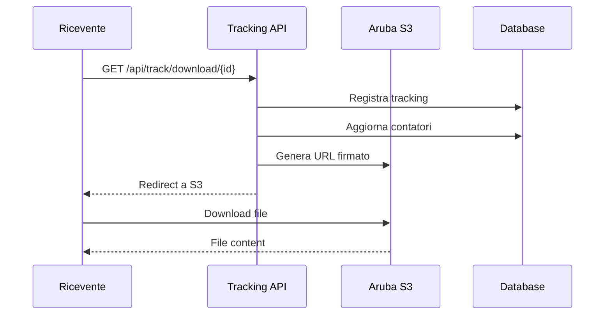

# 🚀 Integrazione Storage S3 Aruba - Opero Mail System

## 📋 Panoramica

Questa guida documenta l'integrazione completa del servizio **Aruba Cloud Storage S3** con il sistema di posta elettronica di Opero per la gestione degli allegati e il tracking dei download.

## ✅ Funzionalità Implementate

### 1. **Storage Allegati S3**
- Upload automatico degli allegati su Aruba S3
- Fallback su storage locale in caso di errore
- Compressione e crittografia lato server
- Organizzazione gerarchica dei file per ditta/utente/data

### 2. **Tracking Download Avanzato**
- Sistema completo di tracciamento download
- Statistiche dettagliate (IP, user agent, timestamp)
- Tracking aperture email con pixel invisibile
- Analytics e reporting per amministratori

### 3. **Pulizia Automatica**
- Job schedulati per eliminazione file obsoleti
- Pulizia tracking logs molto vecchi
- Configurazione retention personalizzabile
- Dashboard statistica pulizie

### 4. **Amministrazione S3**
- API RESTful per gestione storage
- Monitoraggio utilizzo spazio
- Analisi performance download
- Gestione manuale file e cleanup

## 🏗️ Architettura del Sistema

```
┌─────────────────┐    ┌──────────────────┐    ┌─────────────────┐
│   Frontend      │    │   Backend API    │    │   Aruba S3      │
│   (React)       │◄──►│   (Express)      │◄──►│   Storage       │
│                 │    │                  │    │                 │
│ - Mail Module   │    │ - Upload Handler │    │ - File Storage  │
│ - Attachment UI │    │ - S3 Service     │    │ - Signed URLs   │
│ - Tracking UI   │    │ - Cleanup Service│    │ - Encryption    │
└─────────────────┘    └──────────────────┘    └─────────────────┘
         │                        │                        │
         └────────────────────────┼────────────────────────┘
                                  │
                       ┌──────────────────┐
                       │   MySQL Database │
                       │                  │
                       │ - Email Metadata │
                       │ - Tracking Data  │
                       │ - Cleanup Stats  │
                       └──────────────────┘
```

## 📁 Struttura File

```
opero/
├── services/
│   ├── s3Service.js          # Servizio principale S3
│   └── cleanupService.js     # Pulizia automatica
├── routes/
│   ├── mail.js              # Modulo posta aggiornato
│   ├── track.js             # API tracking
│   └── admin-s3.js          # Amministrazione S3
├── migrations/
│   └── 20251203010000_email_tracking_enhancements.js
├── test-s3-integration.js   # Test integrazione
├── .env.example            # Template configurazione
└── INTEGRAZIONE_S3.md      # Questa guida
```

## ⚙️ Configurazione

### 1. **Variabili Environment**

Le variabili environment sono già configurate nel tuo file `.env`. Assicurati che contenga:

```bash
# Configurazione S3 Aruba (già presente nel tuo .env)
S3_BUCKET_NAME=operogo
S3_ENDPOINT=http://r3-it.storage.cloud.it
S3_ACCESS_KEY=your-s3-access-key
S3_SECRET_KEY=your-s3-secret-key
S3_REGION=it-mil-1

# Altre variabili necessarie
PUBLIC_API_URL=http://localhost:3001
ENCRYPTION_SECRET=xxxxxxxxxxxxxxL4eK
```

### 2. **Database Migration**

Esegui la migrazione per le nuove tabelle:

```bash
npx knex migrate:latest
```

### 3. **Installazione Dipendenze**

Le dipendenze necessarie sono già incluse in `package.json`:

```json
{
  "@aws-sdk/client-s3": "^3.933.0",
  "@aws-sdk/s3-request-presigner": "^3.933.0"
}
```

## 🧪 Test di Integrazione

Esegui il test completo per verificare l'integrazione:

```bash
node test-s3-integration.js
```

Il test verificherà:
- ✅ Variabili ambiente configurate
- ✅ Connessione database
- ✅ Tabelle necessarie presenti
- ✅ Connessione S3 Aruba
- ✅ Upload/download file

## 📡 API Endpoints

### Modulo Posta (Aggiornato)

```javascript
POST /api/mail/send-email
Headers: Authorization: Bearer <token>
Body: {
  to: "email@example.com",
  subject: "Test email",
  text: "<p>Email content</p>",
  accountId: 1,
  attachments: [file1, file2] // multipart/form-data
}
```

### Tracking

```javascript
// Tracking download allegato
GET /api/track/download/{downloadId}

// Tracking apertura email
GET /api/track/open/{trackingId}

// Statistiche download
GET /api/track/stats/{downloadId}

// Statistiche admin (protetto)
GET /api/track/admin/email-stats
Headers: Authorization: Bearer <token>
```

### Amministrazione S3

```javascript
// Stato servizio
GET /api/admin-s3/status
Headers: Authorization: Bearer <admin-token>

// Test connessione
POST /api/admin-s3/test-connection
Headers: Authorization: Bearer <admin-token>

// Lista file S3
GET /api/admin-s3/files?prefix=x&limit=100
Headers: Authorization: Bearer <admin-token>

// Elimina file
DELETE /api/admin-s3/files/{s3Key}
Headers: Authorization: Bearer <admin-token>

// Pulizia manuale
POST /api/admin-s3/cleanup
Headers: Authorization: Bearer <admin-token>
Body: {
  s3_days_old: 365,
  local_days_old: 365,
  db_days_old: 180
}

// Statistiche storage
GET /api/admin-s3/storage-analytics
Headers: Authorization: Bearer <admin-token>
```

## 📊 Database Schema

### Nuove Tabelle

#### `download_tracking`
```sql
CREATE TABLE download_tracking (
    id INT AUTO_INCREMENT PRIMARY KEY,
    download_id VARCHAR(255) NOT NULL,
    ip_address VARCHAR(45) NOT NULL,
    user_agent TEXT,
    timestamp DATETIME DEFAULT CURRENT_TIMESTAMP,
    referer VARCHAR(500)
);
```

#### `email_open_tracking`
```sql
CREATE TABLE email_open_tracking (
    id INT AUTO_INCREMENT PRIMARY KEY,
    tracking_id VARCHAR(255) UNIQUE,
    ip_address VARCHAR(45),
    user_agent TEXT,
    opened_at DATETIME,
    open_count INT DEFAULT 1
);
```

#### `cleanup_stats`
```sql
CREATE TABLE cleanup_stats (
    id INT AUTO_INCREMENT PRIMARY KEY,
    cleanup_date DATETIME DEFAULT CURRENT_TIMESTAMP,
    s3_files_deleted INT DEFAULT 0,
    local_files_deleted INT DEFAULT 0,
    db_records_deleted INT DEFAULT 0,
    tracking_logs_deleted INT DEFAULT 0,
    duration_ms INT DEFAULT 0
);
```

### Campi Aggiunti

#### `allegati_tracciati`
```sql
ALTER TABLE allegati_tracciati
ADD COLUMN download_count INT DEFAULT 0,
ADD COLUMN ultimo_download DATETIME NULL,
ADD COLUMN created_at DATETIME DEFAULT CURRENT_TIMESTAMP;
```

#### `email_inviate`
```sql
ALTER TABLE email_inviate
ADD COLUMN open_count INT DEFAULT 0,
ADD COLUMN tracking_id VARCHAR(255) UNIQUE;
```

## 🔄 Flusso di Lavoro

### 1. **Invio Email con Allegati**



### 2. **Download Allegato**



## 🧹 Pulizia Automatica

### Job Schedulati

Il sistema implementa due job schedulati:

1. **Pulizia File Obsoleti** (Giornaliero, 2:00 AM)
   - File S3 più vecchi di 365 giorni
   - File locali più vecchi di 365 giorni
   - Record database orfani

2. **Pulizia Tracking Logs** (Settimanale, Domenica 3:00 AM)
   - Download tracking più vecchi di 2 anni
   - Email open tracking più vecchi di 3 anni

### Configurazione

```javascript
// In cleanupService.js
const FILE_RETENTION_DAYS = 365;      // File S3
const TRACKING_RETENTION_DAYS = 1095; // 3 anni
```

## 📈 Monitoring e Analytics

### Dashboard Amministrazione

Le API `/api/admin-s3` forniscono:

- **Storage Utilization**: Spazio utilizzato per ditta
- **Download Analytics**: Statistiche download per periodo
- **File Performance**: Top file per dimensione/download
- **Cleanup Statistics**: Storico pulizie automatiche

### Metriche Chiave

- **Storage Efficiency**: Percentuale file scaricati
- **Download Velocity**: Velocità download media
- **Attachment Hit Rate**: Success rate download
- **Storage Waste**: Spazio occupato da file non scaricati

## 🔧 Troubleshooting

### Problemi Comuni

#### 1. **Connessione S3 Fallita**
```bash
# Verifica credenziali
curl -X GET "http://r3-it.storage.cloud.it" \
  -H "Authorization: AWS4-HMAC-SHA256 ..."

# Controlla variabili environment
echo $S3_ACCESS_KEY
echo $S3_SECRET_KEY
echo $S3_BUCKET_NAME
echo $S3_ENDPOINT
```

#### 2. **Upload Fallito**
```javascript
// Abilita debug S3
process.env.DEBUG_S3 = 'true';

// Log dettagliato upload
console.log('S3 Upload Debug:', {
  bucket: s3Service.bucket,
  region: s3Service.region,
  endpoint: process.env.ARUBA_S3_ENDPOINT
});
```

#### 3. **Download URL Scaduto**
```javascript
// Genera nuovo URL
const newUrl = await s3Service.getSignedDownloadUrl(s3Key, 3600); // 1 ora
```

### Debug Mode

Abilita il debug dettagliato:

```javascript
// In .env
DEBUG_S3=true
DEBUG_SQL=true
LOG_LEVEL=debug
```

## 🚀 Deployment

### Produzione

1. **Configurazione Environment**
   ```bash
   NODE_ENV=production
   DEBUG_S3=false
   LOG_LEVEL=info
   ```

2. **Verifica Connessioni**
   ```bash
   node test-s3-integration.js
   ```

3. **Monitoraggio**
   - Logs S3 in `/var/log/opero/s3.log`
   - Metrics cleanup in dashboard admin
   - Storage alerts su soglie personalizzate

### Backup e Recovery

- **S3**: Aruba gestisce backup automatici
- **Database**: Backup giornalieri consigliati
- **Metadata**: Esportazione periodica tracking stats

## 📚 Riferimenti

- [Aruba Cloud Storage S3 Documentation](https://docs.arubacloud.com/storage/s3/)
- [AWS SDK for JavaScript v3](https://docs.aws.amazon.com/sdk-for-javascript/)
- [Node.js Multer Middleware](https://github.com/expressjs/multer)
- [Nodemailer Email Service](https://nodemailer.com/)

## 🆘 Supporto

Per problemi o domande:

1. **Controlla logs** applicazione
2. **Esegui test integrazione** completo
3. **Verifica configurazione** environment
4. **Controlla dashboard** amministrazione S3

---

**Versione**: 1.0
**Data**: 03/12/2025
**Autore**: Claude Code Assistant
**Compatibilità**: Opero v8.1+