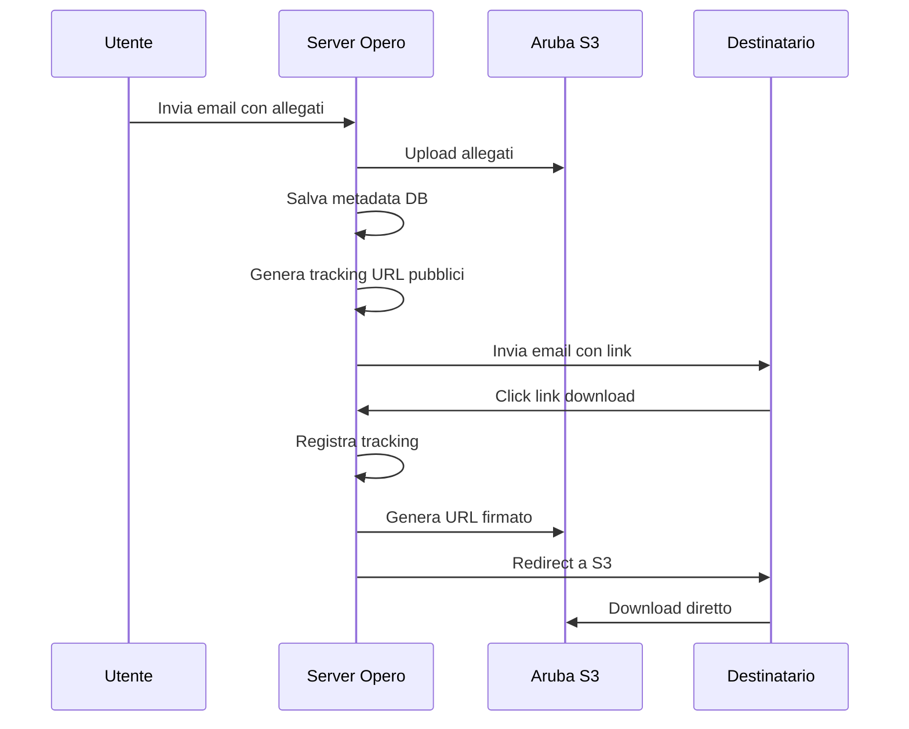

# 🔧 Soluzione Download Allegati Email - Opero

## 🚨 **PROBLEMA IDENTIFICATO**

I destinatari non possono scaricare gli allegati perché il sistema genera link con `localhost:3001`, che non è accessibile dall'esterno.

## 🎯 **SOLUZIONE: Configurare URL Pubblico**

### 1. **Scegli un URL Pubblico**

Opzioni disponibili:

#### **Opzione A: Sviluppo con NGROK (Consigliata per testing)**
```bash
# Installa ngrok
npm install -g ngrok

# Avvia ngrok sulla porta 3001
ngrok http 3001
```

Ngrok ti darà un URL pubblico tipo: `https://abcdef123.ngrok.io`

#### **Opzione B: Dominio Reale (Produzione)**
Se hai un dominio pubblico, usa quello:
```bash
# Esempio
PUBLIC_API_URL=https://tuodominio.it
```

#### **Opzione C: IP Pubblico con Port Forwarding**
Se hai un IP pubblico:
```bash
# Esempio
PUBLIC_API_URL=http://TUO_IP_PUBBLICO:3001
```

### 2. **Aggiorna .env**

Modifica la riga nel tuo `.env`:

```bash
# Sostituisci con il tuo URL pubblico
PUBLIC_API_URL=https://abcdef123.ngrok.io
```

### 3. **Configurazione Server**

Assicurati che il server sia configurato correttamente:

#### **Per NGROK (Testing)**
```bash
# 1. Avvia ngrok in un terminale
ngrok http 3001

# 2. Copia l'URL generato (es. https://abcdef123.ngrok.io)

# 3. Aggiorna .env
PUBLIC_API_URL=https://abcdef123.ngrok.io

# 4. Riavvia il server
npm start
```

#### **Per Produzione**
```bash
# Se usi nginx o un reverse proxy, configura il routing
# Esempio nginx:
server {
    listen 80;
    server_name tuodominio.it;

    location / {
        proxy_pass http://localhost:3001;
        proxy_set_header Host $host;
        proxy_set_header X-Real-IP $remote_addr;
    }
}
```

### 4. **Test Completo**

Esegui il test per verificare:

```bash
# Test con nuovo URL
node debug-email-allegati.js
```

Dovresti vedere URL accessibili pubblicamente.

## 🔍 **Verifica Funzionamento**

### 1. **Test da Browser**
Dopo aver configurato `PUBLIC_API_URL`:

1. Avvia il server: `npm start`
2. Invia una email di test con allegati
3. Copia il link di download dall'email ricevuta
4. Aprilo nel browser - dovrebbe funzionare!

### 2. **Test Tracking**
Il sistema dovrebbe registrare:
- Download nel database
- IP del destinatario
- Timestamp del download

### 3. **Verifica Database**
```sql
SELECT * FROM allegati_tracciati WHERE scaricato = 1;
SELECT * FROM download_tracking ORDER BY timestamp DESC LIMIT 10;
```

## 🚨 **Note Importanti**

### **Sicurezza**
- Gli URL firmati scadono dopo 1 ora (configurabile)
- Solo i destinatari con link validi possono scaricare
- Ogni download viene tracciato

### **Performance**
- Download diretto da S3 Aruba
- Nessun passaggio tramite il tuo server
- Tracking immediato ma asincrono

### **Limitazioni**
- NGROK ha limiti di traffico gratuito
- I link funzionano solo finché il server è attivo
- Gli URL scadono dopo il tempo configurato

## 🔄 **Flusso Completo Funzionante**



## 🛠️ **Troubleshooting**

### **Link non funzionano**
1. Verifica `PUBLIC_API_URL` nel .env
2. Controlla che il server sia attivo
3. Verifica firewall/port forwarding

### **Download lento**
1. Controlla connessione S3
2. Verifica dimensione allegati
3. Controlla rete del destinatario

### **Tracking non registra**
1. Controlla tabella `download_tracking`
2. Verifica log server per errori
3. Testa con URL manuale

## 📞 **Supporto**

Se hai problemi:
1. Controlla i log del server: `tail -f logs/app.log`
2. Esegui test: `node debug-email-allegati.js`
3. Verifica configurazione con: `node test-s3-integration.js`

---

## ✅ **Checklist Completa**

- [ ] Scegliere URL pubblico (ngrok/dominio/IP)
- [ ] Aggiornare `PUBLIC_API_URL` in .env
- [ ] Avviare server con nuova configurazione
- [ ] Testare invio email con allegati
- [ ] Verificare download da destinatario
- [ ] Controllare tracking nel database
- [ ] Testare scadenza URL (1 ora default)

Una volta completati questi passaggi, i destinatari potranno scaricare gli allegati senza problemi! 🎉